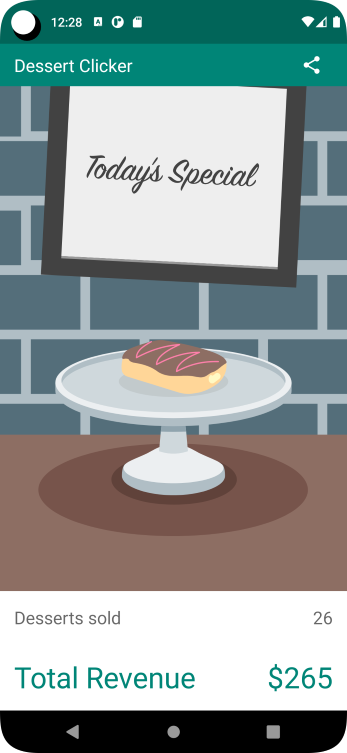

# Dessert Clicker App - Compose

## App Description
Dessert Clicker is a app to help us understand activity lifecycle and configuration changes

## Codelab from developer.android
* **Codelab: 2) Stages of the Activity lifecycle**
  * This is a Walk through Codelab
* **Codelab: 7) Practice: Add a ViewModel to Dessert Clicker**
  * This is a Practice Codelab

## Solution in github
* Codelab: 2) Branch main
  * https://github.com/google-developer-training/basic-android-kotlin-compose-training-dessert-clicker/tree/main
* Codelab: 7) Branch viewmodel
  * https://github.com/google-developer-training/basic-android-kotlin-compose-training-dessert-clicker/tree/viewmodel

## Objective
* Codelab: 2)
  * Log information to the Logcat
  * View Logs with Logcat
  * How to override lifecycle callback methods to perform operations at different times in the activity lifecycle
  * Use rememberSaveable to save values across configuration changes
* Codelab: 7)
  * Practice adding a ViewModel to an app and abstracting logic away from the Activity.

## Notes
How to print logging information to the Logcat  
The basics of the Activity lifecycle and the callbacks that are invoked when the activity moves between states  
How to override lifecycle callback methods to perform operations at different times in the activity lifecycle  
Added Viewmodel and use UiState

## ANDROID BASICS WITH COMPOSE - Unit 4:  Navigation and app architecture - Pathway 1: Architecture Components
Link: https://developer.android.com/courses/pathways/android-basics-compose-unit-4-pathway-1

## Codelab Screenshot

  

ref: dessert-clicker-app-android-kotlin-compose

#appdessertclicker #codelab #logcat #rememberSaveable $viewmodel #uistate
